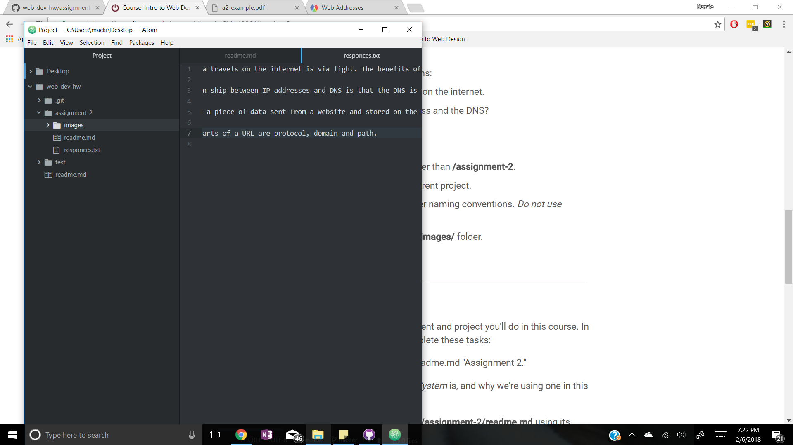

# Assignment 2

A Version Control System is software that manages changes to websites and programs.

Here are my [responces](./responces.txt) for internet protocol.

This assignment was difficult for me for these reasons:
- Remembering all of the markdown language from the week before
- Recalling tools and features of Atom that made creating pages correctly easier like the Markdown preview
- Finding certain information to reference during the assignment because of the volume of information to process

