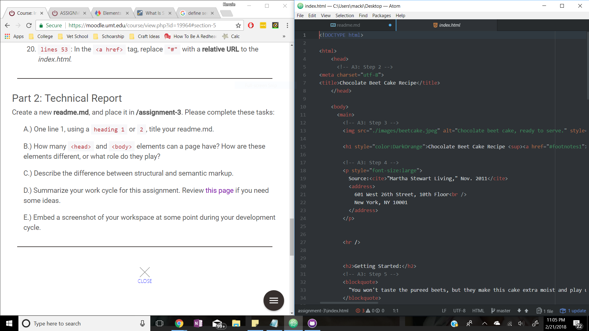

# Readme for Assignment-3

You can only have one <head> and one <body> element. The head element provides the high-level information that is not visible to others such as a title, author and what not that the browser uses. The body is the meat and beans of the page. This is where all the text and visible information of the page is.

Markup is semantic when the tag is used according to what they mean. Using the h1 tag for a headline that is the most important is semantic. Structural isn't so straight foreword like the  tag. This goes to an operational part of the page, not just bolding or lists.

Working through this assignment was pretty straight foreword. The references to specific line numbers kept me on track and helped if I was confused about what the question was asking. I knew I wouldn't get everything right the first time so I made sure to save and update my page frequently so I could fix mistakes along the way.

