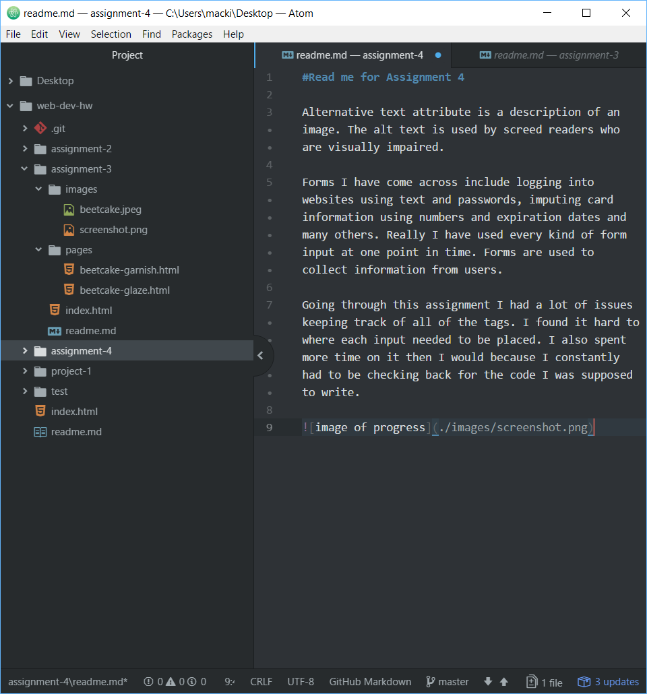

#Read me for Assignment 4

Alternative text attribute is a description of an image. The alt text is used by screed readers who are visually impaired.

Forms I have come across include logging into websites using text and passwords, imputing card information using numbers and expiration dates and many others. Really I have used every kind of form input at one point in time. Forms are used to collect information from users.

Going through this assignment I had a lot of issues keeping track of all of the tags. I found it hard to where each input needed to be placed. I also spent more time on it then I would because I constantly had to be checking back for the code I was supposed to write.

