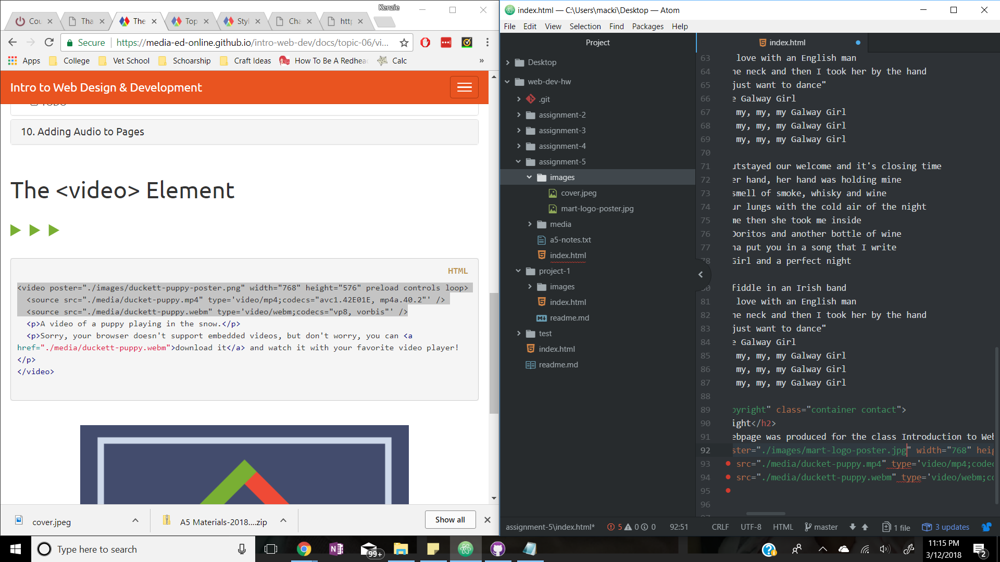

# Readme assignment 5

The difference between divs, classes, ids, and spans are:
- Id is a unique identifer that is different from every other id on the webpage
- Class groups similar types of elements together
- Divs provide block-level element to group other elements together
- Span is the inline version of divs and groups elements within the div element

Third-party uses less bandwidth and allows you to have bigger and better videos and audios while using less space.

I really struggled with some bugs on styling on this assignment. I couldn't get the boarders around the containers and the coloring. It ended up being a small issue that had to be fixed and was easily missed.

