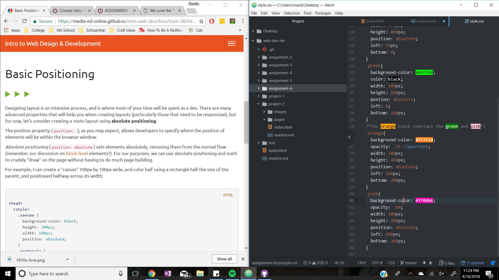

#Read me Assignment 6

I wanted to have a stacked square look with overlapping colors. I really like the black on the neon. I wasn't sure what to do with the graphic so I figured floating my catch phrase would work well. I could not get the orange box to work for the life of me though.

I liked the neon on black approach

- #00ff00
- #ff7f19
- #ff00b6

I really struggle with trying to get everything to work. As soon as I fixed one problem another came up. At first the boxes were in crazy spaces. Once I did that, one of my words quit showing up, even though I didn't change anything.

