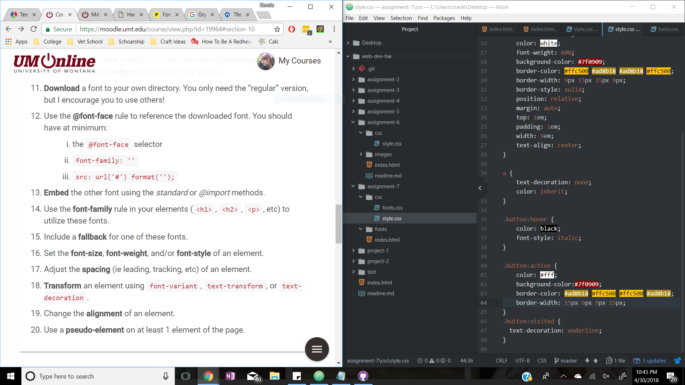

#Read me Assignment 7
With it being Harry Potter, I wanted to do Gryffindor colors to set the mood. It's not very original but it seemed like the best setting. I then wanted to use fonts that showed a vintage feeling so I picked a serif for the body and a san-serif to have the headers pop out.

System fonts are already installed on your device and are available in most programs you use but not the web. Web fonts can be seen on different devices are access through a server but have to be called up correctly. Web-safe fonts are ones that can be counted on to be available by the system.

Fallback fonts are important so your page will have another similar font to go to if the one wanted doesn't show up right away.

I was able to work through this assignment very well. By having a text I was familiar with, it was easy to look up font's and colors that went with Harry Potter. The button was set up and explained so well in the reading that I just had to customize it for my theme. I did struggle with getting my fonts on the page. I think I linked them incorrectly and ended up just deleting the entire thing and retrying.

