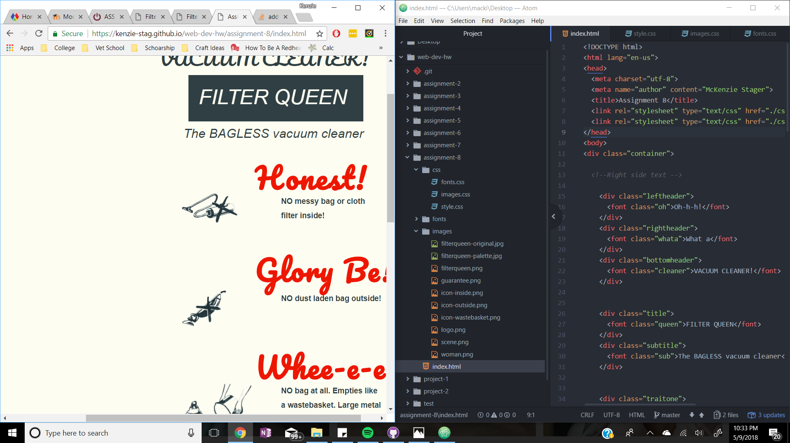

#Read me Assignment 8
Padding is the space between your content and your border. Border is a decoration or line that goes around your content and padding to make it stand out. Margin is the space between your border and other outside content.

The hardest part was trying to get everything where I wanted it. I would try to move an element and then it would take forever to load and would still not be in the correct spot. The load time on this system is terrible and probably the reason I didn't get this nearly as nicely as I wanted. It would take me an hour just to fix one issue I had. I honestly don't even know how this looks still because every time I get on, a new thing changed and I have to try to change it.

Going through this assignment I struggled with what tags would edit what and just how to do it. Resizing images was awful. I finally started looking at how other people coded their pages and that helped me fix mine. I need to break down my boxes even smaller then I had.

