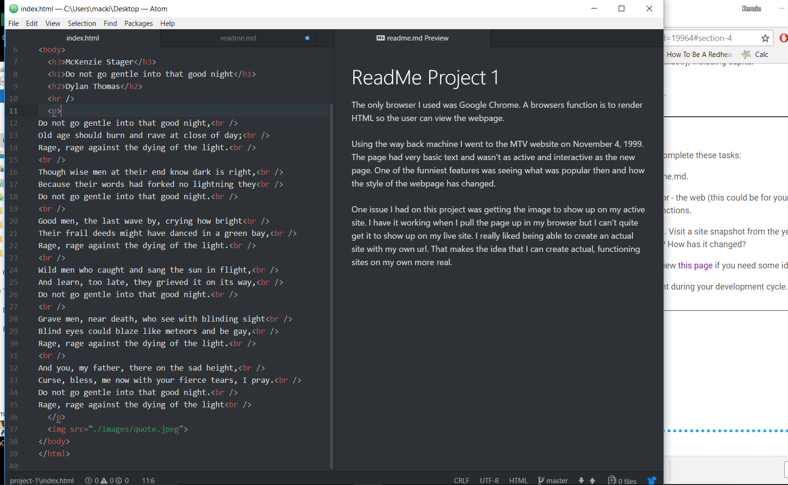

# ReadMe Project 1
The only browser I used was Google Chrome. A browsers function is to render HTML so the user can view the webpage.

Using the way back machine I went to the MTV website on November 4, 1999. The page had very basic text and wasn't as active and interactive as the new page. One of the funniest features was seeing what was popular then and how the style of the webpage has changed.

One issue I had on this project was getting the image to show up on my active site. I have it working when I pull the page up in my browser but I can't quite get it to show up on my live site. I really liked being able to create an actual site with my own url. That makes the idea that I can create actual, functioning sites on my own more real.

