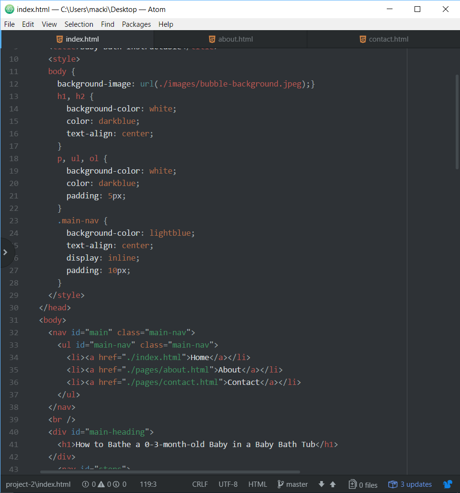

#Project 2 Read Me

The hardest thing with HTML was trying to remember all the different tags and little things that went into them to make them work. I had to constantly be looking back on how to do stuff and it really slows down the process.

I am most anxious about learning how to use CSS to make a more attractive layout for the website. I noticed that even on this beginner assignment, I was really disappointed with how it looks and would have liked buttons on the sides for other pages or something similar that looks more complete.

This project was really difficult when it came to keeping track of everything and trying to make things work. I was trying to make my top navigation header a different style and could never get it to work. It also took over an hour to get the styling correct and for the images to look right. Most of the time it was a tiny error that you couldn't find unless you were constantly searching. I need to find a more efficient way to find my errors in code.

